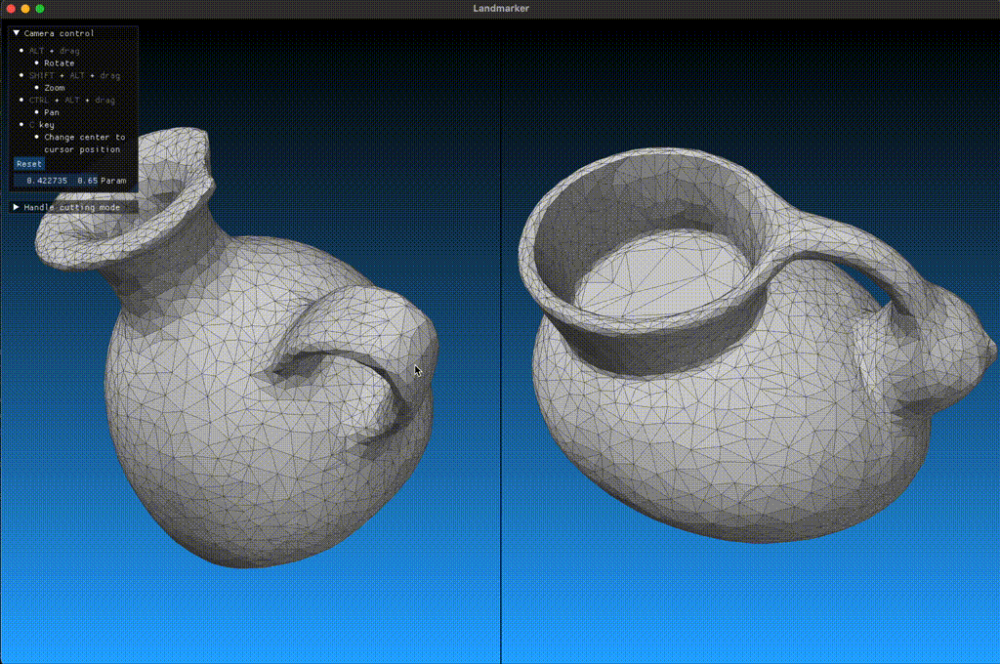
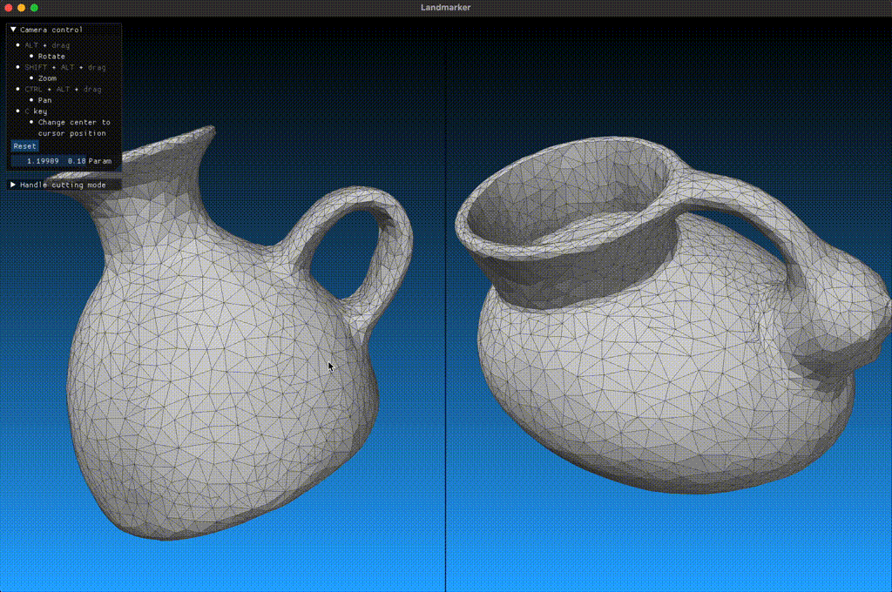
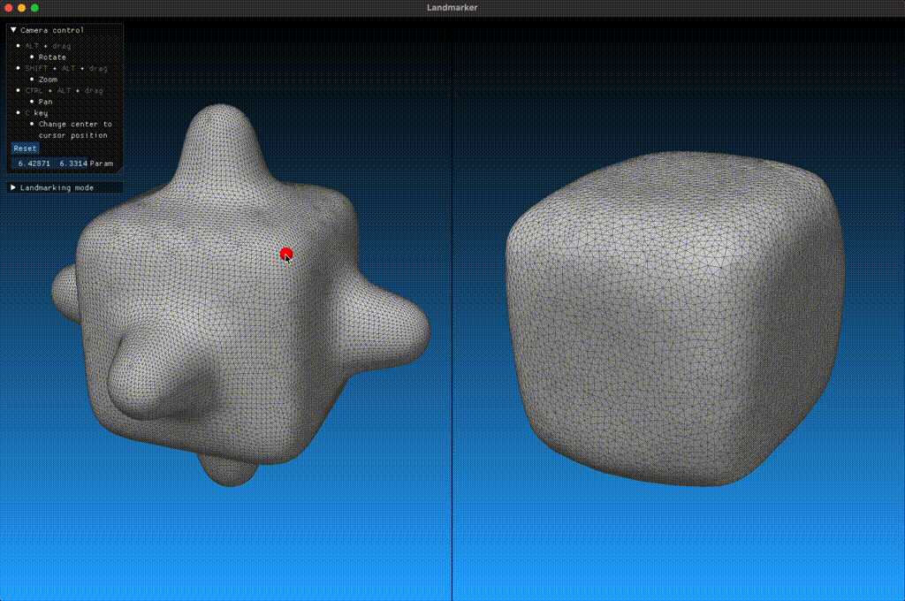
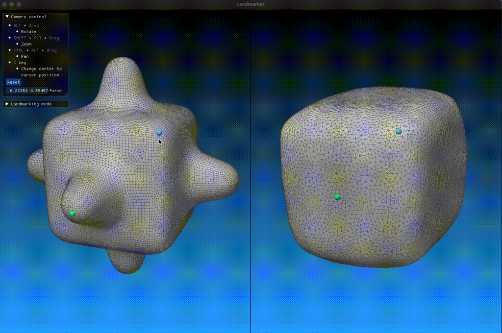
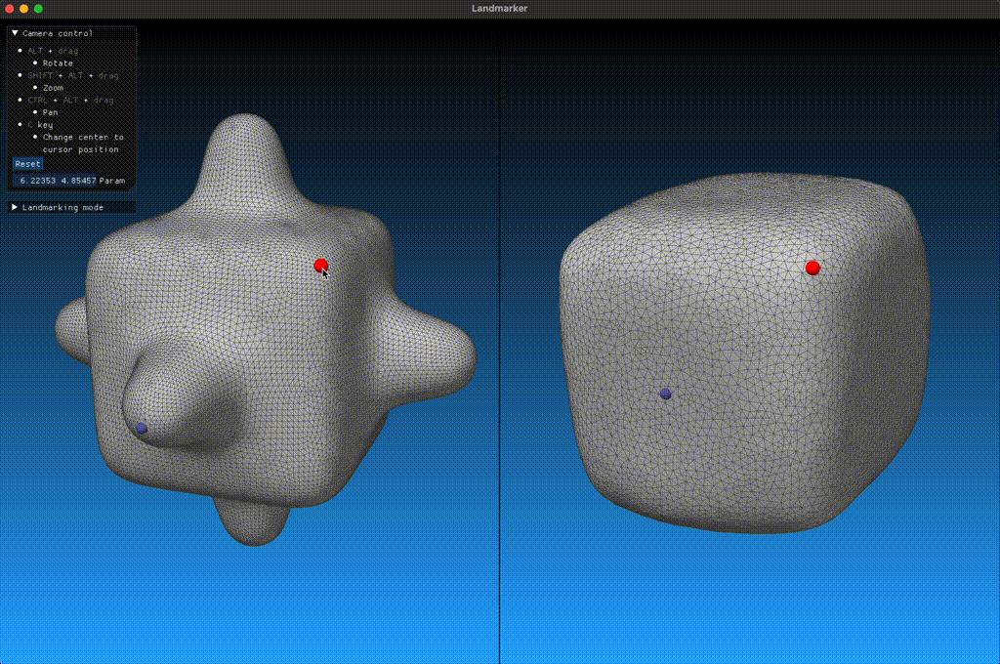
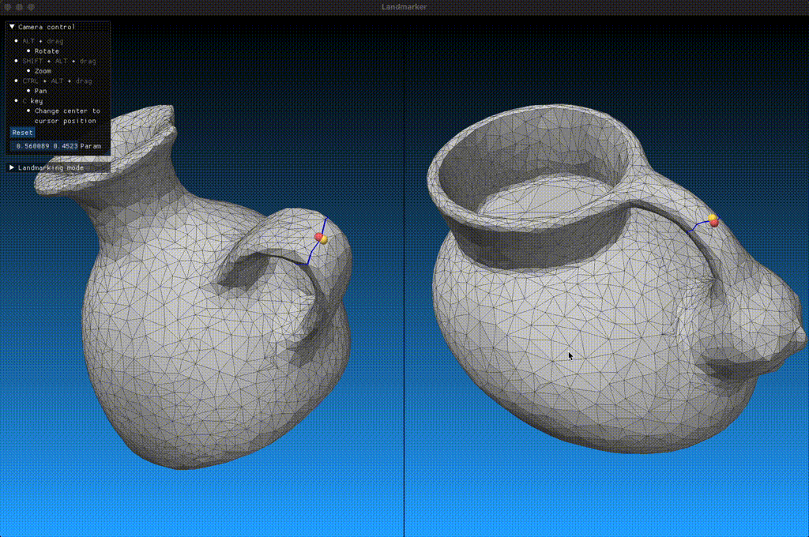

# An unofficial implementation of Seamless Surface Mappings (Aigerman et al., SIGGRAPH 2015)

This is an unofficial implementation of the following publication:

    Seamless surface mappings
    Noam Aigerman, Roi Poranne, and Yaron Lipman
    ACM Transactions on Graphics 34(4), Article No. 72 (August 2015)
    https://doi.org/10.1145/2766921


## Building

See [build.yml](.github/workflows/build.yml) for the steps to build the application.

### Note on MOSEK dependency

As in the original paper, the code depends on the Second-Order Cone Programming (SOCP) solver provided by MOSEK.
To run the main executable `seamlesssurfmap`, you need to have the license file `mosek.lic` installed on your system.
You can get a Personal Academic License at https://www.mosek.com/products/academic-licenses/ for free.


## Usage

The build process generates a few executable files, among which `landmarker` and `seamlesssurfmap` are mainly useful.

### Overview

Common to these two executables, the two surface models, `A` and `B`, should be placed in a common directory (called *data directory*) as `A-orig.obj` and `B-orig.obj`.
Through the various computational steps in the pipeline, the executables generate some intermediate files named as `A-xxx.obj` (e.g., `A-disk.obj`, `B-gmap.obj`).

A list of pairs of corresponding landmark vertices should be given in a file `landmarks.txt` in the data directory.
`landmarker` is a small interactive OpenGL utility for easily creating these landmark pairs (as well as cutting high-genus surfaces into genus zero).
`landmarks.txt` is created by `landmarker` (or by any other means) and is read by `seamlesssurfmap` as an input.

`seamlesssurfmap` computes a G-mapping between the two models (written as `A-gmap.obj` and `B-gmap.obj`), and computes images of `A`'s vertices onto `B` as barycentric coordinates (written as `AtoB.txt`) and vice versa (`BtoA.txt`).
The two files `AtoB.txt` and `BtoA.txt` are in the so-called *IJV-triplet* sparse matrix format which is assumed as input to the [Compatible Intrinsic Triangulations](https://github.com/kenshi84/compatible-intrinsic-triangulations) code.
`seamlesssurfmap` also generates `AonB.obj` as a quick vizualization of `AtoB.txt` by mapping the vertices in `A-orig.obj` onto `B` using the vertex image (and vice versa).


### How to use `landmarker`

Synopsis:
```
  landmarker {OPTIONS}

  OPTIONS:

      --data-dir=[path]                 Path to the data directory to read from
                                        / write to (default: current directory)
      --white-background                Use white background instead of vertical
                                        color gradient
      --write-normalized                Write area-normalized mesh as
                                        *-normalized.obj

```

#### Camera control

* `ALT + drag`: Rotate
* `SHIFT + ALT + drag`: Zoom
* `CTRL + ALT + drag`: Pan
* `C key`: Change camera center to cursor position


#### Handle cutting mode

(This step is skipped for genus zero models.)

For high genus models with one or more handles, those handles need to be cut open so that the surface genus becomes zero (with boundary loops regarded as virtual faces).
To cut along a handle, `SHIFT + click` on each model to specify a landmark to be cut, and press `ENTER` to perform handle cutting.



To choose a tunnel loop rather than a handle loop for the cutting, use `CTRL + ENTER`.



These landmarks specified on handles are called *handle landmarks* and treated differently than other (normal) landmarks.

After cutting all the handles, the executable generates `A-genus0.obj` and `B-genus0.obj` which are read by `seamlesssurfmap`.
The vertex indices in `landmarks.txt` refer to the mesh topology in the genus zero surfaces (where vertices along the cut loops are duplicated).


#### Landmarking mode

* `SHIFT + click`: Specify a landmark on each model, and `ENTER` to confirm the landmark pair.



* `SHIFT + CTRL + click`: Delete the landmark pair.



* `Drag`: Shift a landmark to a nearby vertex.



* `CTRL + click`: (for high genus models only) Switch between the two possible pair assignments for a handle landmark.




### How to use `seamlesssurfmap`

Synopsis:
```
  seamlesssurfmap {OPTIONS}

  OPTIONS:

      --data-dir=[path]                 Path to the data directory to read from
                                        / write to (default: current directory)
      --num-iter=[integer]              Number of iterations for G-mapping
                                        optimization. Negative value means to
                                        iterate indefinitely (default: -1).
      --debug-output                    Enable outputting debug files
      --dont-refine                     Do not perform triangle refinement
                                        around landmarks and between close-by
                                        seams (increases chance of failure)
```

#### On `--dont-refine` flag

By default (without this flag), the program refines the mesh locally around each landmark vertex so that more triangles are available.
This is to lower the possibility of the algorithm failing due to too few triangles available around landmark vertices which may make it impossible to have the final G-mapping completely free of flipped triangles.
The refinement process generates a few additional meshes (`X-orig-refined.obj` and `X-disk-refined.obj`, and `X-genus0-refined.obj` for high genus cases), and the resulting barycentric coordinate files (`AtoB.txt` and `BtoA.txt`) are with respect to the refined meshes (`A-orig-refined.obj` and `B-orig-refined.obj`).
